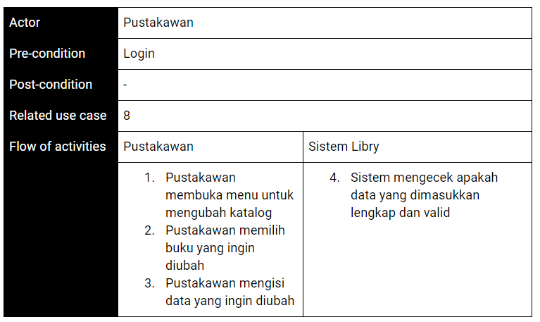

# Libry - Your Pocket Library
Kelompok:
1. Aldi Oktaviana Hidayat &ensp; G64180005
2. Muhammad Thareeq &ensp; &ensp; G6418

## Latar Belakang

Pada abad ke-20, perkembangan teknologi sangatlah pesat dibandingkan dengan abad sebelumnya. Dengan kemajuan teknologi dan pesatnya perkembangan teknologi tersebut, teknologi semakin memudahkan aktivitas manusia. Akibatnya manusia semakin dimanjakan oleh teknologi tersebut, sehingga semakin lama manusia terbiasa dengan hal yang serba cepat termasuk dalam hal cara mengonsumsi informasi. Sekarang ini internet dipilih sebagai pilihan pertama dalam mencari sumber informasi karena kecepatan dan kemudahannya dalam mengakses informasi. Hal ini berbanding terbalik dengan perpustakaan yang kini dijadikan menjadi pilihan terakhir sebagai sumber informasi. Bukan hanya mengenai menjamurnya kebiasaan berselancar di internet, pengunjung perpustakaan juga memiliki masalah dalam sulitnya mencari buku, ketidaktahuan informasi ketersediaan buku, dan administrasi yang kurang praktis.

Eksistensi perpustakaan ini sangat penting karena di dalamnya mengandung banyak koleksi buku terpercaya yang dapat diakses dengan biaya terjangkau dan kualitasnya terkontrol oleh para pustakawan. Jelas berbeda dengan internet, meski memiliki banyak sumber, keabsahan konten di internet sulit untuk dikontrol karena banyak situs yang berbasiskan komunitas. Hal ini dapat menjadi berbahaya karena menurut  survei World Culture Index Score 2018, Indonesia menempati urutan kedua terbawah. Angka literasi ini berbanding lurus dengan rendahnya sikap dalam menyikapi informasi. Oleh karena itu, dibutuhkan sebuah terobosan untuk menggabungkan manfaat perpustakaan dan internet. 

## Tujuan

1. Memudahkan pengguna untuk meminjam buku tanpa harus mengantri di perpustakaan
2. Memudahkan pengguna untuk mengecek ketersediaan buku sebelum ke perpustakaan

## Ruang lingkup
### Perangkat Keras
#### Processor
* Ryzen 5 2500U
* Memory
* 8GB DDR4

#### Graphic card
* Intel UHD
* Storage
* HDD+SSD

### Perangkat Lunak
#### Framework/Stack
- Laravel
- ReactJS
- Material-UI
#### Database
- MySQL

### Server
- Apache
#### Code Editor/IDE
- Visual Studio Code
### Lainnya
#### Development Time
- 4 bulan(16 Minggu)
#### API
- API Mandiri

##  Deskripsi perangkat lunak
**Harus ada yang diubah ya**

Sesuai dengan tujuan pengembangan aplikasi, fitur utama aplikasi ini adalah peminjaman buku. Buku yang dapat dipinjam terdapat dua macam yaitu e-book dan buku fisik. Selain itu, terdapat fitur pendamping lainnya seperti login, register, katalog buku, pratinjau buku, dan juga booking peminjaman.

Sebelum pengguna bisa meminjam buku, pengguna diwajibkan untuk melakukan registrasi. untuk melakukan registrasi, pengguna harus mengisi beberapa persyaratan seperti alamat email, alamat rumah, dan nomor handphone. setelah pengguna berhasil registrasi dan login baru pengguna dapat melakukan peminjaman buku, untuk melakukan peminjaman buku yang perlu dilakukan adalah mencari buku yang ingin dipinjam kemudian isi form yang diperlukan seperti jadwal meminjam.

Buku yang sedang dipinjam baik e-book maupun buku fisik memiliki batas peminjaman. Jika masa peminjaman ebook sudah habis, maka pengguna akan otomatis terblokir untuk membacanya, namun pengguna masih dapat mengajukan peminjaman. Untuk buku fisik, jika sudah melewati batas peminjaman pengguna akan dikenai denda jika buku tersebut belum dikembalikan, untuk menghindari denda tersebut pengguna bisa mengajukan peminjaman buku kembali jika memang buku yang dipinjam lagi tidak ada pengguna lain yang mengantri. 

Jikalau pengguna masih bingung dalam memilih buku untuk dipinjam, pengguna dapat melihat katalog buku. Katalog buku ini berisikan daftar lengkap buku-buku yang berada di perpustakaan. Pengguna dapat melihat pratinjau buku untuk mengetahui apakah buku tersebut merupakan buku yang ia maksud atau bukan. Selain itu terdapat juga ulasan dari pengguna yang sudah membaca sebelumnya mengenai bagaimana isi buku tersebut.

##  Analisis user (user profile)
Umur&ensp;: >12 tahun

Jenis kelamin&ensp;: Laki-laki dan perempuan

Pendidikan&ensp;: >SMP

Personality&ensp;: Inginnya serba cepat dan tidak ribet, sering bepergian, sering membaca dari ponsel

Motivasi&ensp;: Kesulitan mencari buku yang sesuai dengan minat, ribetnya meminjam buku

Goals&ensp;: Bisa mencari buku dengan cepat tanpa harus mencari satu-satu. Bisa meminjam buku tanpa harus mencarinya ke raknya terlebih dahulu, jadi saat di resepsionis langsung bisa mengambil bukunya. 

##  User story
- Sebagai seorang user saya ingin booking buku saat di perjalanan, sehingga saat saya datang ke perpustakaan saya dapat langsung mengambil bukunya.
- Sebagai seorang pustakawan saya ingin mengetahui status peminjaman dengan jelas agar pengorganisiran buku yang dipinjam lebih jelas.
- Sebagai seorang user saya ingin mengatur preferensi tampilan baca buku agar saya dapat nyaman membaca e-book di ponsel saya.
- Sebagai seorang user saya ingin bisa mengorganisir buku yang sedang maupun yang telah dipinjam agar apabila saya membutuhkannya lagi saya bisa mendapatkannya dengan lebih mudah.
- Sebagai seorang user saya ingin bisa membaca pratinjau buku yang ingin dipinjam baik ebook atau pun bukan agar saya mengetahui apakah buku tersebut yang saya cari atau bukan.
- Sebagai seorang user saya ingin bisa melihat tanggapan orang lain mengenai buku yang akan dipinjam agar saya dapat dengan cepat memutuskan buku yang saya inginkan.

##  Use case diagram

##  Use case description

Use Case 1: Melihat Katalog Buku

Use Case 2: Melihat detail buku

Use Case 3: Booking buku fisik

Use Case 4: Pinjam buku digital

Use Case 5: Cek jadwal booking

Use case 6: Baca buku

Use case 7: Input data baru

Use case 8: Mendata peminjaman buku

Use Case 9: Mengubah katalog

##  Activity diagram

Input buku

Edit buku

Baca buku

Booking buku

##  Gantt chart

##  ERD

Entity Relationship Diagram

##  Hasil implementasi perangkat lunak
